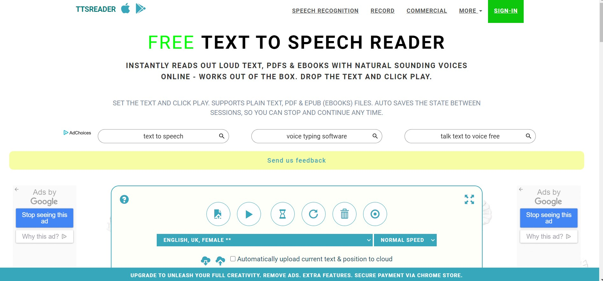
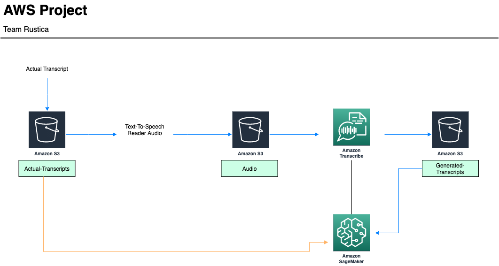

# ACCENTing Transcribe’s Accuracy-Code
This project uses AWS Transcribe to convert English spoken and written texts into multiple non-native English languages. 

In combination with AWS Transcribe, we use Amazon S3 buckets to store our data output from AWS Transcribe. These tools allow us to do all the necessary conversions in order to make our project successful. 

In order to measure the accuracy of AWS Transcribe when converting speech-to-text, in non-native English, we analyzed 3 different texts. We took these texts and converted them into five different country's languages. 

The countries of origin included the United States, United Kingdom, China, Spain, and India. One control we decided to account for is to only look at female voices. This helps control for other variations in the data. We tested these multiple transcripts from various scripts, using Transcribe that is within Sagemaker.

Our data analysis included using Levenshtein distances and a confidence review on Transcribe. The Levenshtein distances was used to measure the difference between two sequences. This helps to determine the amount of single character edits between two scripts. We have included this data in the repo for the user to view.

This project is very useful to our knowledge of AWS and Sagemaker. Using such powerful tools such as Tarnscribe, allows us to better understand AWS. In addition, doing a full accuracy testing on the AWS Transcribe allows us to find any limitations in the program.

As we discuss later on, these little faults give us ideas for future improvements. We can also determine other projects that would benifit from using AWS Transcribe and future applicatiosn of our team's project.

---

# Project Data
Anyone who is interested in replicating this project can access our data in the github repository. We also provide a blog on Google Colab that provides the motivation behind the project, explanations in our analysis (including what the Levenshtein distance is) and a visual for the confidence rating from Amazon Transcribe.

Links for aws help documentation for services!!!!


### ttsreader.com

We decided to use ttsreader.com for converting our original transcripts to speech due to the service’s “natural multilingual voice” feature. This webpage offers male & female voices, in different accents and different languages. It also allowed us to export and save the synthesized speech from our data text. Our project limited the speeches to female voices to minimize the external noise that may have arisen from our analysis.




## Navigating the Repository

To see the transcripts that are being used for transcription: [actual-transcript-for-comparison folder](https://github.com/QTM350/ACCENTing-AWS_Transcribe-Accuracy-Code/tree/main/actual-transcripts-for-comparison)

 Because TTSReader is a paid service, we have provided a collection of all processed recordings in a [google drive](https://drive.google.com/drive/folders/1XMca6gJVa3iX1yEqHoQxlFnAMySBhFmX?usp=sharing). These files can also be located in the [audio-files-for-transcription folder](https://github.com/QTM350/ACCENTing-AWS_Transcribe-Accuracy-Code/tree/main/audio-files-for-transcription).

To see how to generate transcripts using AWS Transcribe: [aws-generated-transcriptions folder](https://github.com/QTM350/ACCENTing-AWS_Transcribe-Accuracy-Code/tree/main/aws-generated-transcripts) 

To see data for Levenshtein Distance: [Data for Levenshtein distance.csv](https://github.com/QTM350/ACCENTing-AWS_Transcribe-Accuracy-Code/blob/main/Data%20for%20Levenshtein%20distance.csv)

To see levels of Transcribe confidence in particular words: [Data_for_word_length_and_confidence.csv](Data_for_word_length_and_confidence.csv)

To access collab notebooks: [notebook-code folder](notebook-code/)

To access the blog for our project: [Qtm350_Final_Blog.ipyng](https://github.com/QTM350/ACCENTing-AWS_Transcribe-Accuracy-Code/blob/main/QTM350_Final_Blog.ipynb)

To view architecture diagram: [arch.png](arch.png)

---


# Project Architecture 



## AWS Cloud Computing Services used:
All AWS cloud computing services used in this project have been listed below along with a link to the official developer guide.

- [Amazon Transcribe]( https://docs.aws.amazon.com/transcribe/latest/dg/what-is-transcribe.html)

- [Amazon SageMaker]( https://docs.aws.amazon.com/sagemaker/latest/dg/whatis.html)

- [Amazon Simple Storage Service](https://docs.aws.amazon.com/AmazonS3/latest/dev/Welcome.html)


### Amazon Transcibe code

`import boto3`
`transcribe = boto3.client('transcribe')`

`job_name = "American_Medium_Transcribed_Correct"`

`job_uri = "https://350-public-audio-files.s3.amazonaws.com/American+Medium+Audio+Extracted+2.wav"`

In this example, we instructed Amazon Sagemaker to look for a file in the "Audio" S3 Bucket. In this bucket, we acquired the file that contains the sound bite of the American-accented female voice reading back the TED Talk transcript.

```
transcribe.start_transcription_job(
    TranscriptionJobName=job_name,
    Media={'MediaFileUri': job_uri}, 
    MediaFormat='wav',
    LanguageCode='en-US',
    OutputBucketName='350-public-generated-transcript'
)
```
### Actual Transcription Process

TranscriptionJobName: the name of this particular transcription job, which is the TED Talk in the American accent in this case.

Media: the media file to be transcribed, which is the actual audio file containing the speaker's rendition of the passage.

MediaFormat: the format of the media file which is in .wav.

LanguageCode: the language of the audio file. We want English in this analysis.

OutputBucketName: the S3 bucket in which we want the transcript to be stored, in this case, 350-public-generated-transcript. 

The remaining audio files were generated into transcripts in this manner.

---

# Improvements & Further Analysis
For further analysis, comparisons can be made between Amazon Transcribe and other speech-to-text services including Dragon Professional, Otter, Speechmatic, etc… Readers may even use this data to do comparisons against other cloud service transcription services like Google Cloud’s Speech-to-Text or Microsoft Azure Speech to Text. These findings can help determine which services are worth the price since all of these examples are paid services.  

This project will also be helpful in comparing the quality of current closed captioning not just for shows on Netflix but for videos on YouTube and other video streaming webpages. This project has the potential to improve the quality of transcription algorithms and ultimately benefit deaf or hard of hearing individuals by highlighing the need for accurately transcribed content.


---

## Sources

### Websites:

AWS. "Amazon Transcribe." [link](https://aws.amazon.com/transcribe/?nc=sn&loc=0)

Besner, Linda. "When Is a Caption Close Enough?" [link](https://www.theatlantic.com/health/archive/2019/08/youtube-captions/595831/)

Diana. "Transcript: A Pep Talk From Kid President." [link]( http://complicatedmelody.com/content/transcript-pep-talk-kid-president)

Everson, Howard T., Tobias, Sigmund. "The ability to estimate knowledge and performance in college: A megacognitive analysis." [link](https://link.springer.com/article/10.1023/A:1003040130125)

List from Wikipedia. "List of countries by English-speaking population." [link](https://en.wikipedia.org/wiki/List_of_countries_by_English-speaking_population)

Radecic, Dario. "Calculating String Similarity in Python." [link](https://towardsdatascience.com/calculating-string-similarity-in-python-276e18a7d33a)

Speech-to-text. [link](https://ttsreader.com/)

Urban, Tim. "Inside the mind of a master procrastinator." [link](https://www.ted.com/talks/tim_urban_inside_the_mind_of_a_master_procrastinator/transcript#t-25363)


